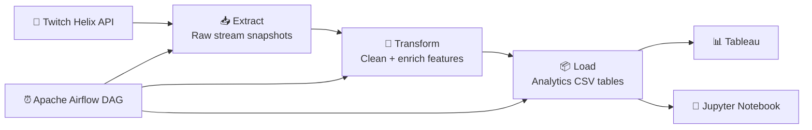
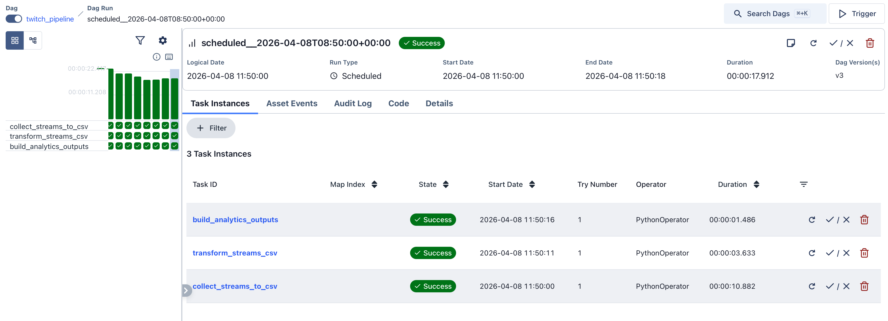

# 🎮 Twitch Streaming Analytics Pipeline

<p align="center">
  
  
  
  
  
</p>

> A **data engineering project** that collects live Twitch stream data from the **Twitch Helix API**, processes it with **Python + Pandas**, orchestrates the workflow in **Apache Airflow**, and publishes **analytics-ready CSV tables** for tools like **Tableau**.

## 📌 Project snapshot

Based on the current collected dataset in this repository:

- 📥 **111,926** raw Twitch snapshot rows collected
- 🧹 **93,830** processed analytical rows after cleaning and enrichment
- 🎥 **6,621** unique streams observed
- 🎮 **802** unique game categories captured
- 🌍 **31** stream languages detected
- 👀 **65,756** viewers at the highest observed peak
- ⏰ Automated refresh cadence: **every 10 minutes** via Airflow

---

## 🧠 Business idea

The goal of the project is to answer questions like:

- Which games attract the highest average or peak viewership?
- Which languages dominate the Twitch streaming landscape?
- At what UTC hours is viewer activity the strongest?
- Which streams are growing the fastest between snapshots?
- How do mature vs non-mature streams compare in audience size?

---

## 🏗️ Architecture



---

## 📸 Demo / screenshots section

```md


```

---

## 🔄 ETL pipeline overview

The Airflow DAG is defined in `dags/twitch_pipeline.py` and runs on the following schedule:

```python
schedule="*/10 * * * *"
```

That means the pipeline can collect a new Twitch snapshot **every 10 minutes**.

### 1) `extract` — collect raw snapshots
File: `src/extract.py`

What happens here:
- authenticates against the Twitch API using `TWITCH_CLIENT_ID` and `TWITCH_CLIENT_SECRET`
- fetches paginated live stream data
- flattens selected fields into CSV format
- appends raw snapshots to:

```bash
data/raw/twitch_streams_snapshots.csv
```

### 2) `transform` — clean and enrich the dataset
File: `src/transform.py`

What happens here:
- parses timestamps into UTC datetimes
- removes duplicate snapshots
- normalizes fields such as `viewer_count`, `language`, `game_name`, and `is_mature`
- computes derived features such as:
  - `stream_duration_minutes`
  - `stream_duration_hours`
  - `snapshot_hour_utc`
  - `viewer_count_delta`
  - `viewer_count_pct_change`
  - `viewer_trend`
  - `viewer_rank_in_snapshot`
- saves the enriched dataset to:

```bash
data/processed/twitch_streams_enriched.csv
```

### 3) `load` — build analytics-ready tables
File: `src/load.py`

What happens here:
- groups the enriched dataset into lightweight analytical summaries
- creates CSV tables specifically designed for reporting and dashboards
- stores them in:

```bash
data/analytics/
```

Generated outputs include:
- `top_games_summary.csv`
- `language_summary.csv`
- `hourly_summary.csv`
- `maturity_summary.csv`
- `fastest_growing_streams.csv`

---

## 📁 Project structure

```text
twitch-project/
├── dags/
│   └── twitch_pipeline.py        # Airflow DAG orchestration
├── src/
│   ├── extract.py                # API extraction and raw CSV storage
│   ├── transform.py              # data cleaning + feature engineering
│   ├── load.py                   # analytical aggregations / outputs
│   └── twitch_api.py             # Twitch API auth + request helpers
├── data/
│   ├── raw/                      # raw appended snapshots
│   ├── processed/                # cleaned and enriched dataset
│   └── analytics/                # BI-ready aggregate tables
├── notebooks/
│   └── scouting_notebook.ipynb   # optional exploration notebook
├── config/
│   └── airflow.cfg
├── docker-compose.yaml           # local Airflow stack
├── pyproject.toml                # Poetry dependencies
└── main.py                       # simple local smoke entry point
```

---

## 🛠️ Tech stack

| Area | Tools |
|------|-------|
| Language | `Python 3.11+` |
| Data processing | `pandas` |
| API access | `requests`, `python-dotenv` |
| Orchestration | `Apache Airflow 3.2` |
| Local infra | `Docker Compose`, `PostgreSQL`, `ClickHouse` |
| Exploration / visualization | `Jupyter Notebook`, `Tableau` |

---

## 🚀 Getting started

### Prerequisites

Before running the project, make sure you have:

- **Python 3.11+**
- **Poetry**
- **Docker Desktop** / Docker Engine with Compose
- A **Twitch Developer** application to obtain API credentials

---

### 1. Clone the repository

```bash
git clone <your-repo-url>
cd twitch-project
```

### 2. Create your environment file

Use the provided template:

```bash
cp .env.example .env
```

Then fill in your credentials inside `.env`:

```env
TWITCH_CLIENT_ID=your_client_id_here
TWITCH_CLIENT_SECRET=your_client_secret_here
AIRFLOW_UID=50000
```

> 💡 You can create Twitch credentials in the [Twitch Developer Console](https://dev.twitch.tv/console).

### 3. Install Python dependencies

```bash
poetry install
```

---

## ▶️ Run the pipeline

### Option A — Run with Airflow + Docker Compose (recommended)

Start the local Airflow stack:

```bash
docker compose up -d
```

Then open the Airflow UI:

- URL: `http://localhost:8080`
- Username: `airflow`
- Password: `airflow`

Inside the UI:
1. Find the DAG `twitch_pipeline`
2. Unpause it
3. Click **Trigger DAG**

This will execute the ETL flow:

```text
collect_streams_to_csv → transform_streams_csv → build_analytics_outputs
```

### Option B — Run the steps manually from Python

#### Extract a snapshot
```bash
poetry run python -c "from src.extract import collect_and_store_streams_snapshot; collect_and_store_streams_snapshot(max_pages=2, page_size=100)"
```

#### Transform the raw data
```bash
poetry run python -c "from src.transform import transform_raw_snapshots; transform_raw_snapshots()"
```

#### Build analytics tables
```bash
poetry run python -c "from src.load import load_analytics_outputs; load_analytics_outputs()"
```

#### Quick smoke run
```bash
poetry run python main.py
```

---

## 📊 Analytics outputs

The project generates several CSV tables that are immediately useful for BI dashboards.

| Output file | What it shows | Typical visualization |
|------------|----------------|-----------------------|
| `top_games_summary.csv` | Average and peak viewers by game | bar chart / leaderboard |
| `language_summary.csv` | Stream performance by language | bar chart / treemap |
| `hourly_summary.csv` | Viewer activity by UTC hour | line chart |
| `maturity_summary.csv` | Audience comparison by maturity flag | comparison bar chart |
| `fastest_growing_streams.csv` | Biggest positive changes in viewers | highlight table |

These files live in:

```bash
data/analytics/
```

---

## 📈 Using the outputs in Tableau

This project is intentionally designed so the final output can be plugged into a BI tool.

### Typical workflow:
1. Open **Tableau Public** or **Tableau Desktop**
2. Click **Connect → Text file**
3. Select one of the CSV files from `data/analytics/`
4. Drag dimensions and measures to build your chart
5. Combine several sheets into a dashboard

### Dashboard ideas for a portfolio presentation:
- 🎮 **Top Games Dashboard** — average viewers and peak viewers by game
- 🌍 **Language Overview** — distribution of audiences by stream language
- ⏰ **Best Streaming Hours** — viewer activity trend by `snapshot_hour_utc`
- 📈 **Fastest Growing Streams** — top audience spikes over time

---

## 🙋 Author

**Marie Muravyeva**  

---

## 📜 License

This project is released under the **MIT License**. See `LICENSE` for details.
